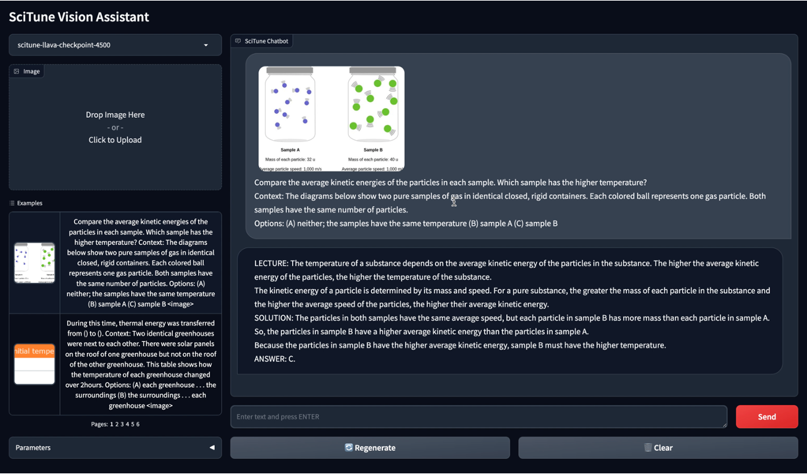

<p>
  
  <span style="font-size: 2em; font-weight: bold; vertical-align: middle;">SciTune Vision Assistant</span>
</p>

*Visual instruction tuning towards large language and vision models.*


## Contents
- [Install](#Install)
- [Prerequisites](#Prerequisites)
- [SciTune Weights](#SciTune-Weights)
- [Preprocessing](#preprocessing)
- [Training](#training)
- [Evaluation](#evaluation)
- [Inference](#Inference)
- [Dashboard](#Dashboard)


## Install

If you are not using Linux, do *NOT* proceed, see instructions for [macOS](https://github.com/haotian-liu/LLaVA/blob/main/docs/macOS.md) and [Windows](https://github.com/haotian-liu/LLaVA/blob/main/docs/Windows.md).

1. Clone this repository and navigate to SciTune folder
```bash
cd SciTune/
```

2. Install Package (Skip this step if using Docker)
```Shell
conda create -n llava python=3.10 -y
conda activate llava
pip install --upgrade pip  
pip install -e .
```

## Prerequisites
- After cloning the repository, create 'dataset' and 'models' folder 
```bash
mkdir dataset
mkdir models
```
Follow the instuctions below to download and save the data in dataset folder 
- ArxivCap: https://huggingface.co/datasets/MMInstruction/ArxivCap 
- SciCap: https://huggingface.co/datasets/CrowdAILab/scicap

## SciTune Weights
In this Vision Assistant tool, we use the SciTune model, fine-tuned with the ScienceQA dataset, to demonstrate multimodal reasoning capabilities. The tool answers multiple-choice questions based on visual and textual information and generates an answer, along with a lecture and explanation supporting the answer.

## Preprocessing
To run the prpeprocessing script:
```bash
cd scitune/preprocessing
'docker build -t scitune_preprocess .'. 
'sudo docker run --mount type=bind,source=/home/ubuntu/scitune_data,target=/opt/scitune_data -it scitune_preprocess'
```
Above command activates interactive docker shell. Run preprocessing scripts inside docker shell-
```bash
python generate_instructions_arxivcap.py <datapath> <filetype>
python generate_instructions_scicap.py <datapath>
```

## Training
```bash
cd scitune/training
'docker build -t scitune_train .'. 
'sudo docker run --mount type=bind,source=/home/ubuntu/scitune_data,target=/opt/scitune_data --gpus all -it scitune_preprocess'
```
Above command activates interactive docker shell. Run training bash scripts inside docker shell-
```bash
bash finetune_llava.sh
bash train_llava.sh
```

## Evaluation
To run the evaluation script:
```bash
cd scitune/evaluation
'docker build -t scitune_eval .'. 
'sudo docker run --mount type=bind,source=/home/ubuntu/scitune_data,target=/opt/scitune_data -it scitune_eval'
```
Above command activates interactive docker shell. Run evaluation scripts inside docker shell-
```bash
bash eval_llava_mathvista.sh
bash eval_llava_scicap.sh
bash eval_llava_scienceqa.sh
bash eval_llava_vistext.sh
```

## Inference 
Model inference is performed by the worker(llava/serve/model_worker.py). The model worker performers inference on the GPU. The worker handles the input resquest that is either a text or a combination of text and image to generate the output in the form of text. 


## Dashboard
Please follow the instructions below to run the dashbaord locally. 

### Gradio Web UI - Dokcer 
Navigate to the SciTune directory in the repo and run the following command - 
```bash
docker compose up
```

This will install all the dependencies and run the dashboard on port 7860 by default. Please update docker-compose.yaml file to update parameters like the model path name, ports etc.

### Gradio Web UI - Withoout Docker 
To launch a Gradio demo locally, please run the following commands one by one. If you plan to launch multiple model workers to compare between different checkpoints, you only need to launch the controller and the web server *ONCE*.


#### Launch a controller
```Shell
python -m llava.serve.controller --host 0.0.0.0 --port 10000
```

#### Launch a gradio web server.
```Shell
python -m llava.serve.gradio_web_server --controller http://localhost:10000 --model-list-mode reload
```
You just launched the Gradio web interface. Now, you can open the web interface with the URL printed on the screen. You may notice that there is no model in the model list. Do not worry, as we have not launched any model worker yet. It will be automatically updated when you launch a model worker.

#### Launch a model worker

This is the actual *worker* that performs the inference on the GPU.  Each worker is responsible for a single model specified in `--model-path`.

```Shell
python -m llava.serve.model_worker --host 0.0.0.0 --controller http://localhost:10000 --port 40000 --worker http://localhost:40000 --model-path liuhaotian/llava-v1.5-13b
```
Wait until the process finishes loading the model and you see "Uvicorn running on ...".  Now, refresh your Gradio web UI, and you will see the model you just launched in the model list.

You can launch as many workers as you want, and compare between different model checkpoints in the same Gradio interface. Please keep the `--controller` the same, and modify the `--port` and `--worker` to a different port number for each worker.
```Shell
python -m llava.serve.model_worker --host 0.0.0.0 --controller http://localhost:10000 --port <different from 40000, say 40001> --worker http://localhost:<change accordingly, i.e. 40001> --model-path <ckpt2>
```

If you are using an Apple device with an M1 or M2 chip, you can specify the mps device by using the `--device` flag: `--device mps`.

#### Launch a model worker (Multiple GPUs, when GPU VRAM <= 24GB)

If the VRAM of your GPU is less than 24GB (e.g., RTX 3090, RTX 4090, etc.), you may try running it with multiple GPUs. Our latest code base will automatically try to use multiple GPUs if you have more than one GPU. You can specify which GPUs to use with `CUDA_VISIBLE_DEVICES`. Below is an example of running with the first two GPUs.

```Shell
CUDA_VISIBLE_DEVICES=0,1 python -m llava.serve.model_worker --host 0.0.0.0 --controller http://localhost:10000 --port 40000 --worker http://localhost:40000 --model-path liuhaotian/llava-v1.5-13b
```

#### Launch a model worker (4-bit, 8-bit inference, quantized)

You can launch the model worker with quantized bits (4-bit, 8-bit), which allows you to run the inference with reduced GPU memory footprint, potentially allowing you to run on a GPU with as few as 12GB VRAM. Note that inference with quantized bits may not be as accurate as the full-precision model. Simply append `--load-4bit` or `--load-8bit` to the **model worker** command that you are executing. Below is an example of running with 4-bit quantization.

```Shell
python -m llava.serve.model_worker --host 0.0.0.0 --controller http://localhost:10000 --port 40000 --worker http://localhost:40000 --model-path liuhaotian/llava-v1.5-13b --load-4bit
```


### CLI Inference

Chat about images using LLaVA without the need of Gradio interface. It also supports multiple GPUs, 4-bit and 8-bit quantized inference. With 4-bit quantization, for our LLaVA-1.5-7B, it uses less than 8GB VRAM on a single GPU.

```Shell
python -m llava.serve.cli \
    --model-path <path_to_model_weights> \
    --image-file "https://llava-vl.github.io/static/images/view.jpg" \
    --load-4bit
```
<p style = "align:center">

<figcaption style="text-align: center;"><em>Figure 1: SciTune Vision Assistant</em></figcaption>
</p>


